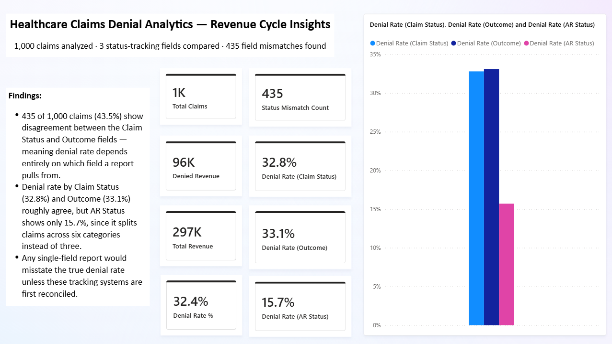
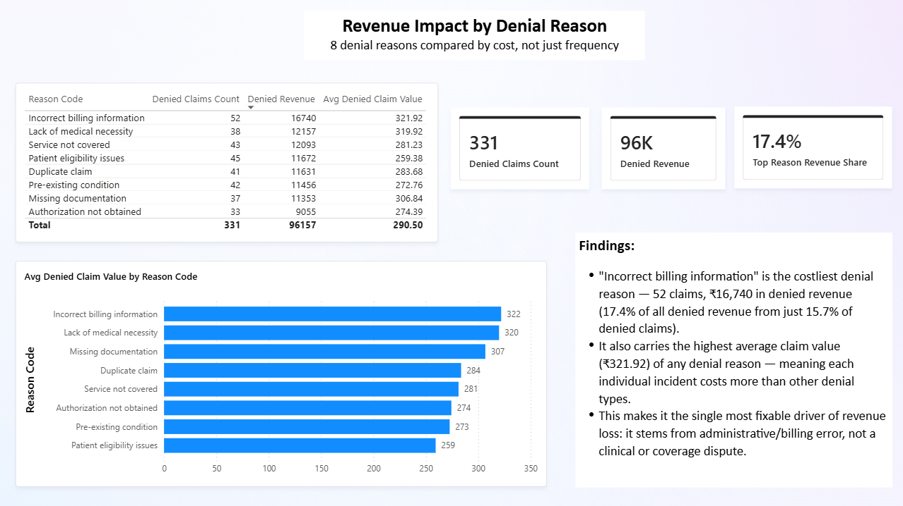

# Healthcare Claims Denial Analytics

A Power BI analytics layer built over 1,000 healthcare claims, modelling where revenue is
actually lost in the denial-management process — and whether the systems tracking that
process can even agree with each other.

Claims systems typically track status across more than one field — a claim-processing status,
a resolution outcome, an accounts-receivable status. Each is usually maintained by a different
team or system. This project checks whether those fields tell the same story, models the
claims as a star schema, and quantifies where denied revenue is concentrated by reason.

**The analysis found the three status-tracking fields disagree on 43.5% of claims** — see
[FINDINGS.md](FINDINGS.md).

| | |
|---|---|
| **Source data** | [Synthetic Healthcare Claims Dataset](https://www.kaggle.com/datasets/abuthahir1998) (Kaggle) |
| **Claims analysed** | 1,000 |
| **Status fields compared** | 3 — Claim Status, Outcome, AR Status |
| **Denial reasons tracked** | 8 |
| **Tooling** | Power BI Desktop · Power Query (M) · DAX |

---

## Dashboard

### Page 1 — Status Field Reliability



### Page 2 — Revenue Impact by Denial Reason



---

## Headline results

| Metric | Value | Reading |
|---|---:|---|
| Total claims | 1,000 | — |
| Status field mismatch | 435 claims (43.5%) | Claim Status and Outcome disagree |
| Denial rate (Claim Status) | 32.8% | — |
| Denial rate (Outcome) | 33.1% | roughly agrees with Claim Status |
| Denial rate (AR Status) | 15.7% | diverges — 6 categories instead of 3 |
| Costliest denial reason | Incorrect billing information | 17.4% of denied revenue, highest avg. claim value |

The gap between the three denial rates is the finding. A report built on any single field
would misstate the true denial rate — the fields use incompatible category schemes, not just
different numbers.

---

## How it works

```text
  Synthetic claims CSV (Kaggle)
          │
          ▼
  Power Query — type correction, dimension extraction
          │
          ▼
  Star schema (Claims fact + 3 dimensions)
          │
          ▼
  DAX measures — denial rate per field, revenue at risk, mismatch count
          │
          ▼
  Power BI report (2 pages)
```

### 1. Model

`Claims` is the fact table (1,000 rows, one per claim). Three dimension tables are built by
referencing `Claims` and reducing to distinct values:

```text
                    ┌──────────────────┐
                    │      Claims       │   1,000 claims (fact)
                    └─────────┬─────────┘
          ┌──────────────────┼──────────────────┐
          ▼                  ▼                  ▼
  Dim_InsuranceType   Dim_ReasonCode         Dim_Date
     (4 rows)            (8 rows)         (365 rows, 2024)
```

### 2. Measures

Written in DAX. The two worth explaining:

**Status Mismatch Count** — counts every claim where the Claim Status field and the Outcome
field disagree on whether the claim was denied. Two fields that are supposed to track the same
event, maintained independently, is a realistic symptom of disconnected billing/denial
systems.

```dax
Status Mismatch Count =
CALCULATE(
    COUNTROWS(Claims),
    FILTER(
        Claims,
        (Claims[Claim Status] = "Denied") <> (Claims[Outcome] = "Denied")
    )
)
```

**Denial Rate, computed three ways** — the same underlying claims, filtered by whichever
status field is asked. Comparing all three side by side is what exposes the divergence; any
one of them in isolation looks like a normal, reportable denial rate.

```dax
Denial Rate (Outcome) =
DIVIDE(
    CALCULATE(COUNTROWS(Claims), Claims[Outcome] = "Denied"),
    [Total Claims], 0
)
```

---

## Repository contents

```text
claims-denial-analytics/
├── dashboard/
│   └── claims-denial-analytics.pbix   the Power BI file
├── data/
│   └── claim_data.csv                 1,000 rows — source claims data
├── screenshots/
│   ├── page1-status-mismatch.png
│   └── page2-denial-reasons.png
└── FINDINGS.md
```

---

## Opening the dashboard

Download `dashboard/claims-denial-analytics.pbix` and open it in Power BI Desktop (free,
Windows only). No account or sign-in is required — the data is embedded in the file, so every
visual renders without the source CSV.

---

## Notes on the data

The dataset is synthetic, generated to resemble realistic claims data rather than sourced from
an actual payer or provider. This avoids any PHI/compliance concern, at the cost of the
findings being illustrative of a realistic *pattern* rather than a claim about any real
organisation's actual denial rate.

---

## Author

**Abinaya Moorthy** — QA Engineer
Test automation · API testing · CI/CD · QA & data analytics

---

## License

MIT — see [LICENSE](LICENSE).
